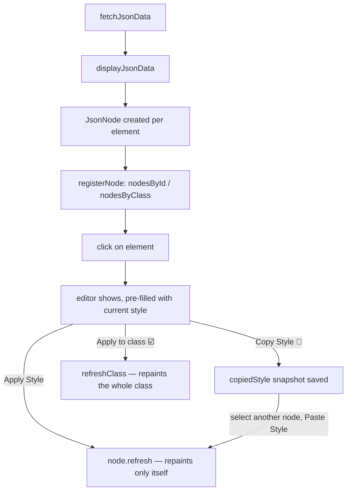

<div align="center">

# 🔍✨ JSON Viewer ✨🔍

### *Point it at any JSON. Watch it come alive. Then bend it to your will.*

A **vanilla JavaScript** playground that fetches a JSON object and recursively
renders it as a fully clickable, fully styleable DOM tree — no frameworks,
no build step, no dependencies. Just a `<script>` tag and your imagination.

[](#)
[](#)
[](#)
[](#-roadmap)

</div>

---

## 📖 Table of Contents

- [✨ What is this?](#-what-is-this)
- [🚀 Quick Start](#-quick-start)
- [🧩 Features](#-features)
- [🏗️ Architecture](#️-architecture)
- [🕹️ Usage Walkthrough](#️-usage-walkthrough)
- [📂 Project Structure](#-project-structure)
- [🗺️ Roadmap](#️-roadmap)
- [👤 Creator](#-creator)

---

## ✨ What is this?

You paste a JSON API URL in, hit **Load**, and every key, value, object and
array gets turned into its own little styleable DOM element — nested exactly
like the data is nested. Click any of them and a floating editor pops up
letting you restyle it live: color, font, spacing, borders, you name it.

Think of it as **DevTools for JSON**, except every node remembers where it
came from, who its parents and children are, and how it's currently dressed.

> 💡 **Why?** Because turning raw data into a styled one-pager shouldn't
> require React, Tailwind, or a build pipeline. Just a browser.

---

## 🚀 Quick Start

```bash
# 1. Clone or download this folder
git clone <this-repo-url>
cd JSONviewer

# 2. Open it. That's it.
#    Double-click index.html — it works straight from disk (file://).
```

<details>
<summary>🌐 Prefer serving it over HTTP instead? (optional)</summary>

```bash
python -m http.server 8000
```

Then browse to **http://localhost:8000**. Either approach works identically —
`index.html` loads `jsonNode.js` and `script.js` as plain scripts, so there's
no CORS/module fuss either way.

</details>

---

## 🧩 Features

| | Feature | Details |
|---|---|---|
| 🌳 | **Recursive rendering** | Any valid JSON — objects, arrays, primitives, deeply nested — becomes a live DOM tree. |
| 🖱️ | **Click-to-edit** | Click *any* rendered element and a style editor pops up right there. No selecting from a sidebar, no hunting. |
| 🎨 | **Live style editor** | Pick a CSS property from a dropdown, see its **current value pre-filled**, tweak it, hit Apply. |
| 🧪 | **Copy/Paste styling (pipette)** | Sample a style off one element, click around the tree, paste it onto a completely different element — *later*. |
| ☑️ | **Per-element *or* per-class styling** | A checkbox switches between "just this element" and "every element shaped like this one." |
| ⚡ | **Targeted reactive refresh** | Changing the global default style refreshes everything; changing a class refreshes only that class; changing one element refreshes *only that element*. No full page rebuild. |
| 🧵 | **Live spacing controls** | Click the spacer strip to redefine indentation width / line height for the whole tree, instantly. |
| 💾 | **One-click HTML export** | Download your styled creation as a standalone `.html` file. |

---

## 🏗️ Architecture

Every rendered element is backed by a `JsonNode` — a small object that keeps
the rendering, the data, and the styling cleanly separated:

```text
            ┌─────────────────────────────┐
            │           JsonNode           │
            ├───────────────────────────────┤
            │ data             → live JSON value (or primitive)
            │ parentContainer  → the object/array holding it (write-back!)
            │ key              → its property name / array index
            │ parent / children→ links to the rest of the tree
            │ element          → the actual <div> on the page
            │ ownStyle         → reactive per-node style overrides
            ├───────────────────────────────┤
            │ computeStyle()   → merges default + class + own style
            │ refresh()        → repaints *just this* element
            └───────────────────────────────┘
```



Style changes are powered by a tiny reactive `Proxy` wrapper
(`makeReactive`) — mutate a style object anywhere (console, UI, future code)
and the right scope refreshes automatically: **global → everything**,
**class → that class**, **node → that node only**.

---

## 🕹️ Usage Walkthrough

1. **Load some data**
   Type a JSON API URL (and API key, if needed) and hit **Load** — or just
   hit Load with the field empty to fetch the built-in D&D 5e API demo.

2. **Click anything you see**
   A key, a value, a whole array row — click it. The editor slides into
   view, already showing the property's *current* value.

3. **Pick a property, tweak the value, hit Apply**
   The editor closes itself and the element updates instantly.

4. **🧪 Sample a look, paste it elsewhere**
   Click an element you like → **Copy Style** → click a totally different
   element, any time later → **Paste Style**. Done.

5. **☑️ Going broad?**
   Tick **Apply to class** before hitting Apply/Paste to restyle every
   element that shares the same structural "shape" instead of just one.

6. **Drag the spacer strip**
   Re-tune indentation width and line height for the *entire* tree in one
   click — no rebuild, just a fast restyle pass.

7. **💾 Download**
   Hit **Download** to export your styled tree as a standalone HTML file.

---

## 📂 Project Structure

```text
JSONviewer/
│
├── index.html        # Markup shell + script tags
├── styles.css         # Base page styling
├── script.js          # App logic: fetching, layout, editor, reactivity
├── jsonNode.js         # The JsonNode class — one per rendered element
└── README.md           # You are here 👋
```

---

## 🗺️ Roadmap

This is a **proof of concept** — proof that a data-based one-pager creator
can run entirely on vanilla JS. Next stops:

- [ ] Even more intuitive editing UX
- [ ] More options at element selection
- [ ] Modifying the base data, not just its presentation
- [ ] Saving/restoring editing sessions
- [ ] Going fully CSS-free — handle *everything* through JavaScript

---

<div align="center">

## 👤 Creator

**Balázs Dénes Róbert**

*Built with vanilla JS, stubbornness, and zero frameworks.* 🟨

</div>
